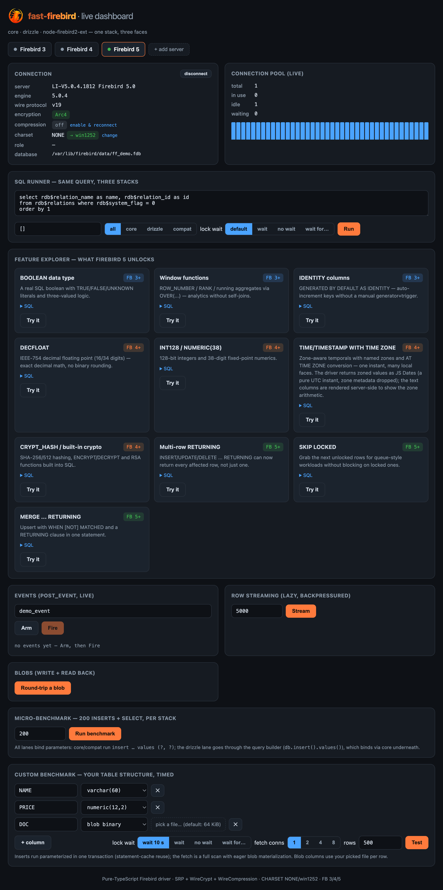

<p align="center">
  
</p>

<p align="center">
  A next-generation Firebird SQL driver for Node.js — <b>pure TypeScript</b>, zero native
  dependencies, speaking the Firebird wire protocol directly (protocols 13–20) with
  first-class support for <b>Firebird 3, 4, and 5</b> — plus <b>Firebird 6</b> (snapshot, protocol 20).
</p>

<p align="center">
  <a href="https://github.com/mreis1/fast-firebird/actions/workflows/ci.yml"></a>
  <a href="./LICENSE"></a>
  = 22">
</p>

```ts
import { connect } from '@fast-firebird/core';

const db = await connect({
  host: 'localhost',
  port: 3050,
  database: '/data/app.fdb',
  user: 'SYSDBA',
  password: 'masterkey',
});

const rows = await db.query('select id, name from users where id = ?', [1]);
const one  = await db.queryOne<{ ID: number; NAME: string }>('select id, name from users where id = ?', [1]);

await db.transaction(async (tx) => {
  await tx.execute('insert into users (id, name) values (?, ?)', [2, 'Alice']);
});

await db.disconnect();      // or: await using db = await connect({ … })
```

## Why another Firebird driver?

The existing Node.js options are projects we learned a lot from, and
`node-firebird` deserves particular respect: it carried this maintainer's
production systems for years, and much of the Node + Firebird community with
it. It grew up in the callback era and spent a decade prioritizing
compatibility with very old Node.js versions; its recent 2.x line has been
modernizing at an impressive pace (TypeScript, promises, protocol 20).
`node-firebird-driver-native` is well-engineered but binds to the native
`fbclient` library, which complicates containers, serverless platforms, and
simple onboarding.

fast-firebird is different by design rather than by patching: it started from
a blank page in 2026 with a modern Node.js baseline (≥ 22), no
backwards-compatibility baggage, and the wire protocol itself as the design
center. Round trips are treated as the scarcest resource — counted, exposed
(`Attachment.roundTrips`), and asserted exactly in the driver's own tests —
which is a property you architect in from the start, not one you retrofit. On
top of that sits a pure-TypeScript, promise-native driver that speaks the
modern wire protocol (up to protocol 20) with Srp256 authentication and
Arc4/ChaCha wire encryption, covers the full FB4/5 type system (DECFLOAT,
INT128, `TIMESTAMP/TIME WITH TIME ZONE` with the zone preserved), rides
FB5/FB6 inline blobs, and ships the surrounding pieces — backpressured
streaming, events, the Services API, a connection pool, a script parser, and a
Drizzle ORM adapter — in one coherent package.

The engineering is test-driven against real servers: **1085 core tests + 90
Drizzle tests** run in CI against a real Firebird 3/4/5/6 container matrix,
many of them asserting exact wire round-trip counts, byte-exact blob content
(SHA-verified), and error-path connection reuse. Design trade-offs are
documented where you'll hit them (eager-by-default blobs, lazy-handle
transaction scoping, the statement-cache metadata-pinning caveat), and the
`plans/` and `diary/` directories record the *why* behind every decision.

## Feature overview

- **Connectivity** — SRP256/Srp/Legacy_Auth, Arc4/ChaCha/ChaCha64 wire crypt, zlib wire compression, connect timeouts covering the whole handshake, FB6 `searchPath`/`owner` attach options
- **Queries** — promise API (`query`, `queryOne`, `run`, `execute`), positional `?` or named `@name` parameters, typed rows `query<T>()`, prepared statements, per-connection LRU statement cache, adaptive batched fetching with per-query `fetchSize`
- **Result shaping** — `ColumnInfo` metadata, `rowMode: 'array'`, `exclude`/`only` column filters, `expandStar` (`select *` rewritten to explicit columns before prepare)
- **Streaming** — `queryStream` async iterator with batch-level backpressure
- **Blobs** — eager or lazy (per subtype, per column), 64KB segments with cross-blob pipelining, partial reads (`head()`) with resume, streaming reads/writes, read-ahead for streams, batch prefetch, `toFile()`, FB5/FB6 inline blobs (small blobs cost zero round trips)
- **Types** — every scalar type including DECFLOAT(16/34), INT128, and zone-preserving `ZonedDate`
- **Transactions** — isolation/read-only/lock-wait options, `restart()`, nested transactions via savepoints, opt-in RO→RW auto-upgrade, `await using` support
- **Ecosystem** — connection pool, `POST_EVENT` listener, Services API (server info, gstat, gbak backup/restore), isql-faithful script parser, Drizzle ORM adapter (with nested transactions, plain-SQL migrator, RDB$ introspection → schema codegen), legacy `CHARSET NONE` transcoding toolkit

## Queries

### `run` and its shortcuts (`query`, `queryOne`, `execute`)

There is **one** execution primitive — `run()` — that works for any statement
(SELECT, INSERT/UPDATE/DELETE, DDL) and returns everything the server reported:

```ts
const { rows, rowsAffected, columns } = await db.run('update t set x = 1 where y = ?', [2]);
```

`query`, `queryOne`, and `execute` are thin, typed shortcuts over `run()` — they
run the exact same call and just project the field you asked for, with a return
type to match. Reach for the shortcut that fits; drop to `run()` when you want
more than one field back:

```ts
// Each is `async` — await it; the arrow shows what it resolves to.
db.run(sql, p)       // → { rows, rowsAffected, columns }   (the primitive)
db.query(sql, p)     // → run().rows            : Row[]
db.queryOne(sql, p)  // → run().rows[0]         : Row | undefined
db.execute(sql, p)   // → run().rowsAffected    : number
```

```ts
const rows = await db.query('select id, name from users');               // Row[]
const user = await db.queryOne('select * from users where id = ?', [7]); // Row | undefined
const n    = await db.execute('delete from log where created < ?', [cutoff]); // number

// Compile-time row typing (no runtime validation) flows through the shortcut:
interface User { ID: number; NAME: string }
const typed = await db.query<User>('select id, name from users');
typed[0].NAME; // string
```

`queryOne` returns the first row or `undefined` — the full result set is still
fetched, so add `FIRST 1` (or a unique predicate) when many rows could match.
`execute` ignores any rows a statement produces, so use it for writes/DDL where
you only care about the affected count. All four take the same
`(sql, params, options)` shape and the same positional-or-named parameters
(below). The pool exposes the same `query`/`queryOne`/`run`/`execute` set, each
acquiring a connection for the single call.

### Named parameters (`@name`)

Pass an **object** instead of an array and mark placeholders with `@name`. The
driver rewrites `@name` to positional `?` and reorders the values client-side —
so the object key order is irrelevant, and a name repeated in the SQL is bound
in every slot it appears:

```ts
const rows = await db.query(
  'select * from emp where dept = @dept and sal > @min',
  { dept: 10, min: 5000 },
);

// Works everywhere params do — execute, streams, prepared statements, the pool:
await db.execute('update emp set name = @name where id = @id', { name: 'Ann', id: 1 });

const stmt = await db.prepare('select * from emp where dept = @dept');
await stmt.query({ dept: 10 });   // re-run with different objects
```

We use `@` rather than `:name` on purpose: a leading colon (`:var`) is a
**PSQL local-variable reference** in Firebird — `@name` has no meaning anywhere
in the SQL/PSQL grammar, so it's unambiguous even inside an `EXECUTE BLOCK`
body. Markers inside string literals, quoted identifiers, `q'{…}'` literals and
comments are left untouched. Positional `?` + array params keep working
unchanged; mixing a named object with `?`-only SQL throws a `FirebirdParamError`.

### Column metadata & array rows

Every `run()`/`QueryResult` carries `columns: ColumnInfo[]` — the row key
(alias-aware), underlying field, source relation, friendly SQL type name, and
nullability, exactly as the columns appear in the rows:

```ts
const { rows, columns } = await db.run('select * from invoices', [], { rowMode: 'array' });
// columns[i].name is the positional header for rows[n][i]
```

`rowMode: 'array'` preserves duplicate/aliased column names positionally —
intended for ORM adapters and grid UIs.

### Column filtering & `select *` expansion

```ts
await db.query('select * from docs', [], { exclude: ['PHOTO'] });   // or { only: [...] }
await db.query('select * from docs', [], { exclude: ['PHOTO'], expandStar: true });
```

Without `expandStar`, `exclude`/`only` filter at decode time (blob columns are
then never fetched, scalars still cross the wire). With `expandStar: true` the
driver rewrites top-level `*` / `alias.*` / `table.*` into an explicit column
list *before* preparing, so excluded columns are genuinely never sent by the
server. Rewrites cost one extra prepare per unique (sql, only, exclude), are
cached, and are invalidated by DDL. Top-level `UNION` is not supported, and
Firebird itself rejects a bare `*` mixed with other select items — qualify it
(`select t.*, 1 as x from t`).

### Per-query fetch sizing

```ts
await db.query('select * from wide_rows', [], { fetchSize: 50 });
```

Fetching is adaptive by default (batches sized from the described row width
against a byte budget, ramping up across a scan). `fetchSize` — per connection
or per query — is the ceiling on rows per fetch round trip.

## Transactions

```ts
const tx = await db.startTransaction({ isolation: 'readCommitted', readOnly: true });
const rows = await tx.query('select first 1 1 as v from rdb$database');

await tx.restart();                        // commit + reopen, same strategy
await tx.restart({ action: 'rollback' });  // rollback + reopen, same strategy
await tx.restart({ readOnly: false });     // commit + reopen with a new strategy

await tx.execute('insert into t (id) values (?) returning id', [1]);
await tx.commit();
```

`restart` reuses the same `Transaction` object (its `handle` changes) — handy
for long-running loops that periodically checkpoint. Lazy blob handles from
before a restart become invalid (reading one throws `FirebirdBlobError`).

### Nested transactions (savepoints)

`tx.transaction(fn)` runs `fn` inside a SAVEPOINT: released on success,
rolled back to on error — the outer transaction survives either way, and
scopes nest arbitrarily:

```ts
await db.transaction(async (tx) => {
  await tx.execute('insert into audit (msg) values (?)', ['always kept']);
  await tx.transaction(async () => {
    await tx.execute('insert into risky (x) values (?)', [1]);
    throw new Error('undo just this part');
  }).catch(() => {});
  // the audit row survives; the risky row was rolled back
});
```

### `await using` (explicit resource management)

`Attachment`, `Transaction`, `Pool`, and `PreparedStatement` implement
`Symbol.asyncDispose`:

```ts
{
  await using tx = await db.startTransaction();
  await tx.execute('insert into t (id) values (1)');
  await tx.commit();        // without this line, scope exit ROLLS BACK
}
```

Disposal semantics: an attachment disconnects, an uncommitted transaction
rolls back, a pool closes, a prepared statement is freed.

### Read-only auto-upgrade (opt-in)

Some codebases run read-mostly transactions and occasionally write. With
`autoUpgradeReadOnly` (per transaction, or as a connection-wide default), a
write that fails with *"attempted update during read-only transaction"* makes
the driver commit the (write-free) read-only transaction, reopen it read-write
with the same isolation, and replay that statement once:

```ts
const tx = await db.startTransaction({ readOnly: true, autoUpgradeReadOnly: true });
await tx.execute('insert into audit (msg) values (?)', ['late write']); // upgrades + replays
tx.autoUpgraded; // true
```

Honest caveats: the upgrade is a real commit + new transaction (the snapshot
moves forward and earlier lazy blob handles die), and only
`query`/`run`/`execute` replay — `queryStream` and prepared statements don't.
Off by default.

## Streaming large result sets

`queryStream` yields rows lazily in adaptively-sized batches — the next
`op_fetch` only fires as you consume, so a huge table never lands in memory at
once and an early `break` stops after just a batch or two:

```ts
for await (const row of db.queryStream<Order>('select * from big_table order by id')) {
  process(row);            // backpressure-friendly; break any time
}

// Node stream ergonomics:
import { Readable } from 'node:stream';
const stream = Readable.from(db.queryStream('select * from big_table'));
```

`db.queryStream` runs in its own transaction (committed at end, rolled back on
error/break); `tx.queryStream` streams within a transaction you own. Don't run
other statements on the *same* connection mid-stream — use another connection
or the pool for concurrency.

## Blobs

### Eager by default, lazy on request

By default blob columns are materialized during decode — text blobs (memos)
arrive as decoded strings, binary blobs as Buffers. This default is
deliberate: *"SELECT gives me values" is the near-universal driver
expectation, and lazy leaks transaction-lifetime concerns into ordinary code.*

For big or optional blobs, lazy modes return a `Blob` handle per non-null
cell — nothing is fetched until you ask, so blobs you don't touch cost
**zero** round trips:

```ts
blobs: 'lazy'          // every blob column → Blob handle
blobs: 'lazy-binary'   // binary blobs lazy, memos eager (the file-export sweet spot)
blobs: 'lazy-text'     // memos lazy, binary eager
blobs: { default: 'lazy-binary', eager: ['THUMB'], lazy: ['A.HUGE_XML'] } // per column
```

Available per query or as a connection default. Column names are alias-aware
(`'DOC'` or `'A.DOC'`, case-insensitive); naming a column in both lists throws.

```ts
await db.transaction(async (tx) => {
  for await (const row of tx.queryStream('select id, photo, notes from docs', [], { blobs: 'lazy-binary' })) {
    // row.NOTES is already a string (eager memo); row.PHOTO is a Blob handle
    if (wanted(row.ID)) await (row.PHOTO as Blob).toFile(`out/${row.ID}.jpg`);
  }
});
```

`Blob` handles are **transaction-scoped** — read them before the transaction
ends (a stale handle throws `FirebirdBlobError`). Lazy-capable configurations
therefore require `tx.query`/`queryStream`; `db.query` with a lazy config
throws with guidance.

### Reading: buffer, text, stream, file, size

```ts
const buf  = await blob.buffer();                    // whole blob, cached
const txt  = await blob.text();                      // subtype-1 decoded via column charset
const size = await blob.size();                      // op_info_blob, 1 round trip
const n    = await blob.toFile('/exports/doc.pdf');  // streamed to disk, returns bytes

await pipeline(blob.stream({ chunkSize: 64 * 1024 }), fs.createWriteStream('out.jpg'));
```

Streams are backpressured and one-shot; abandoning one (destroy, `break`, or
error) closes the server-side handle immediately — nothing leaks until
transaction end.

### Partial reads: `head()` + resume

For magic-number sniffing and content-type detection:

```ts
const magic = await blob.head(16);      // first 16 bytes, cursor stays open
if (isPng(magic)) {
  const all = await blob.buffer();      // RESUMES — no re-open, no re-transfer
} else {
  await blob.close();                   // release the cursor early
}
```

`head(n)` keeps the server handle open at its position; a later `buffer()`,
`stream()` or wider `head()` continues from byte n instead of starting over.
Reading to the end promotes the bytes into the regular cache.

### Writing: Buffers, strings, streams

Blob parameters accept `Buffer`, `string` (encoded via the column charset) —
or any `Readable`/`AsyncIterable<Buffer | string>`, uploaded in pipelined
64KB segments without buffering the source in memory:

```ts
await tx.execute('insert into files (id, doc) values (?, ?)', [1, fs.createReadStream('big.iso')]);
```

(A lazy `Blob` handle can't be bound directly as a parameter — it would
deadlock the connection's operation lock; pass `await blob.buffer()`.)

### Performance: pipelining, read-ahead, prefetch, inline

Blob transfer is round-trip-bound, so the driver attacks round trips:

- **64KB segments + cross-blob pipelining** — batch reads keep a deep window
  of segment requests in flight *across* blobs (openings pipelined ahead,
  closes deferred), instead of one segment per round trip.
- **`blobReadAhead`** (lazy blobs in `queryStream`) — while you process row N,
  the driver prefetches upcoming rows' blob contents in bounded background
  slices, so `.buffer()/.text()/.stream()` usually resolve without touching
  the wire. `true` | depth | `{ columns, depth, maxBytes }` (default 16MiB
  budget), per query or as a connection default; purely an optimization —
  skipped rows and budget overruns fall back to on-demand reads.

  ```ts
  for await (const row of tx.queryStream(sql, [], { blobs: 'lazy', blobReadAhead: 2 })) {
    await (row.DOC as Blob).toFile(path(row));   // usually zero extra round trips
  }
  ```

- **`prefetchBlobs(blobs)`** — batch-fetch an explicit set of handles (e.g.
  every `THUMB` of a page of rows) in one pipelined burst before use.
- **FB5 inline blobs (protocol 19, Firebird 5.0.2+)** — small blobs/memos ride
  *with the row data*: zero extra round trips, no opt-in needed. The driver
  announces `maxInlineBlobSize` (default 65535 bytes, `0` disables) on every
  execute; received-but-unread inline blobs are budgeted by
  `maxBlobCacheSize` (default 10MiB) and scoped to their transaction. All
  read paths — eager, lazy, streams, read-ahead — consult the inline cache
  first.

## Zone-preserving time zone types (FB4+)

By default, `TIMESTAMP/TIME WITH TIME ZONE` columns decode to JS `Date` — the
exact UTC instant, zone dropped. Opt in to keep the zone:

```ts
const db = await connect({ …, timeZones: 'zoned' });

const [row] = await db.query("select ts from events");
const z = row.TS;            // ZonedDate { date: Date(UTC instant), zone: 'Europe/Lisbon' | '+02:30' }
z.toString();                // 2026-07-13T14:30:00.000Z[Europe/Lisbon]
z.date.toLocaleString('pt-PT', { timeZone: z.zone });  // wall-clock rendering via Intl

await db.execute('insert into events (ts) values (?)',
  [new ZonedDate(new Date('2026-07-13T14:30:00Z'), 'Europe/Lisbon')]);  // round-trips zone + instant
```

Named zones come from a table generated from the Firebird source (637 zones,
tzdata 2026b); offsets decode as `±HH:MM`. Connection-level option (column
readers are cached per statement). DECFLOAT and INT128 are likewise fully
supported in both directions (strings/bigints bind losslessly), including the
DECFLOAT specials — `'Infinity'`, `'-Infinity'` and `'NaN'` decode as those
strings and bind back as parameters (JS `Infinity`/`NaN` numbers work too).

## Prepared statements & the statement cache

Every connection keeps an LRU cache of prepared statements keyed by SQL text
(`statementCacheSize`, default 64; `0` disables). Measured round trips,
asserted by integration tests on FB 3/4/5/6:

| Operation (inside an open transaction) | Round trips |
|-----------------------------------------|-------------|
| cold query (prepare → rows)             | 2           |
| warm query, one batch                   | **1** (execute + fetch coalesced) |
| warm DML including affected count       | **1** (execute + counts coalesced) |

For hot paths you can also pin a statement explicitly:

```ts
await using stmt = await db.prepare('select name from users where id = ?');
const rows = await stmt.query([42], tx);       // 1 round trip per execution
const one  = await stmt.queryOne([42], tx);
```

> **Metadata-lock caveat** (standard Firebird behavior): a prepared statement —
> cached or pinned — holds existence locks on the objects it references, so
> DDL on those tables from *other* connections waits until the statement is
> released. DDL executed through the same connection clears the cache
> automatically; `db.clearStatementCache()` / `pool.clearStatementCaches()`
> release the handles explicitly before external migrations.

## Connection pooling

```ts
import { createPool } from '@fast-firebird/core';

const pool = await createPool({ host, database, user, password, min: 2, max: 10 });

const rows = await pool.query('select * from users where id = ?', [1]); // acquire→run→release
const one  = await pool.queryOne('select * from users where id = ?', [1]);
await pool.transaction(async (tx) => { /* … */ });
await pool.use(async (conn) => { /* borrow explicitly */ });

await pool.close();          // or: await using pool = await createPool({ … })
```

Each pooled connection is a full `Attachment` with its own statement cache, so
warm statements survive across acquire/release. The pool enforces `max`
concurrency, validates connections with `op_ping` on borrow, evicts idle
connections down to `min`, and times out `acquire` when saturated.

For parallel work, `pool.map` runs a function over items across connections
with bounded concurrency (results in input order):

```ts
const parts = await pool.map(idRanges, (conn, range) =>
  conn.query('select * from big where id between ? and ?', [range.lo, range.hi]),
  { concurrency: 4 },
);
```

(A lazy `Blob` handle is bound to the connection+transaction that produced it,
so parallelize by running the *query* per partition — not by sharing handles.)

## Drizzle ORM adapter

`@fast-firebird/drizzle` plugs the driver into [Drizzle](https://orm.drizzle.team):

```ts
import { connect } from '@fast-firebird/core';
import { drizzle, firebirdTable, integer, varchar, timestamp } from '@fast-firebird/drizzle';
import { eq } from 'drizzle-orm';

const users = firebirdTable('users', {
  id: integer('id').primaryKey(),
  name: varchar('name', { length: 40 }),
  created: timestamp('created'),
});

const orm = drizzle(await connect({ … }));
const rows = await orm.select().from(users).where(eq(users.id, 1));
```

Firebird is Postgres-shaped, so the adapter reuses Drizzle's pg-core query
builder with a Firebird dialect (parameter binding, `FIRST/SKIP` pagination,
`RETURNING`) and Firebird-correct date/time/blob column types. Nested
`tx.transaction()` works via savepoints. 88 integration tests against FB 3/4/5/6.

**Relational queries**: flat `db.query.users.findMany()`/`findFirst()`
(columns/where/orderBy/limit/offset) work — they compile to plain selects.
Nested `with:` is rejected with guidance: it requires JSON aggregation
functions Firebird doesn't have; use explicit joins instead.

**Migrations**: drizzle-kit can't generate for Firebird, so the package ships
a plain-SQL migrator — `.sql` files applied in name order, recorded in a
tracking table, full isql syntax per file (incl. `SET TERM`/PSQL). Statements
commit individually (isql AUTODDL-style — Firebird DML can't see a table
created in the same uncommitted transaction), so keep migrations small and
idempotent:

```ts
import { migrate } from '@fast-firebird/drizzle';
await migrate(orm, { migrationsFolder: './migrations' }); // 0001_init.sql, 0002_…
```

**Introspection**: generate a Drizzle schema from an existing database's RDB$
metadata (tables, column types incl. NUMERIC precision/scale and blob
subtypes, nullability, single & composite primary keys):

```ts
import { introspectDatabase, generateDrizzleSchema } from '@fast-firebird/drizzle';
const tables = await introspectDatabase(att);
await fs.writeFile('schema.ts', generateDrizzleSchema(tables));
```

## Multi-statement scripts

```ts
await db.executeScript(`
  set term ^ ;
  create or alter procedure add_log (msg varchar(100)) as
  begin
    insert into audit_log (message) values (:msg);
  end^
  set term ; ^
  execute procedure add_log('migrated');
`);
```

The parser is isql-faithful: honors `SET TERM`, PSQL bodies (no naive `;`
splitting), string/quoted-identifier/`q'…'` literals, and `--` / `/* */`
comments, with line/column error positions. `executeScript` supports
`transaction: 'perScript' | 'perStatement' | 'none'`, `continueOnError`, and an
`onProgress` callback. `parseScript(sql)` is also exported standalone.

## Events (POST_EVENT)

```ts
const events = await db.events(['order_placed', 'stock_low']);
events.on('order_placed', (count) => refreshOrders());
events.on('post', (name, count) => console.log(name, count));
// … later
await events.close();
```

Uses Firebird's async event channel (a separate socket), so it never blocks
queries on the connection. The first delivery per event is a silent baseline —
only posts occurring after subscription fire. Firebird's one-shot requests are
re-armed automatically. *(Docker note: the async channel needs a fixed,
published `RemoteAuxPort` — see `docker/docker-compose.yml`.)*

## Services API

```ts
import { connectService } from '@fast-firebird/core';

const svc = await connectService({ host, user: 'SYSDBA', password: 'masterkey' });
const info = await svc.getServerInfo();      // version, implementation, security db
const stats = await svc.getStatistics('/data/app.fdb');  // gstat output

// Server-side gbak (both paths are SERVER paths); returns the verbose log.
await svc.backup('/data/app.fdb', '/backups/app.fbk');
await svc.restore('/backups/app.fbk', '/data/app_copy.fdb');            // create
await svc.restore('/backups/app.fbk', '/data/app.fdb', { replace: true }); // overwrite

await svc.disconnect();
```

## Legacy `CHARSET NONE` databases (the € problem)

Databases declared `NONE` whose bytes were written as Windows-1252 by legacy
(Delphi) software round-trip cleanly:

```ts
const db = await connect({
  database: '/data/legacy.fdb',
  charset: 'NONE',
  charsetNoneEncoding: 'win1252',        // simple strategy
  // or full control (node-firebird2-compatible):
  // transcodeAdapter: { text: { fromDb: b => iconv.decode(b, 'win1252'),
  //                             toDb:  s => iconv.encode(s, 'win1252') } },
  // or per-field:
  // charsetOverrides: { 'HISTORY.MEMO': 'win1252' },
});

const rows = await db.query("select memo from history where memo like ?", ['%€%']);
```

## Firebird 6 (protocol 20, schemas)

Against an FB6 server the driver negotiates protocol 20 automatically (inline
blobs included), and the new attach-time options are exposed:

```ts
// Schema search path — how unqualified names resolve (FB6 default: PUBLIC, SYSTEM)
const db = await connect({ host, database, searchPath: ['APP', 'PUBLIC'] });
await db.query('select * from settings');   // finds APP.SETTINGS

// Create a database owned by another user
await createDatabase({ host, database, owner: 'APP_OWNER' });
```

Both options are silently ignored by pre-FB6 servers, so they're safe to set
in configs shared across versions. FB6 support is tracked against the
`firebirdsql/firebird:6-snapshot` image in CI (the same suite as FB3/4/5); a
canary test watches for the arrival of upstream JSON support.

## Authentication, encryption & compression

`wireCrypt` is `'enabled'` by default (Arc4 negotiated; `'required'` /
`'disabled'` available). ChaCha/ChaCha64 are negotiated on FB4+ via
`wireCryptPlugin`. `wireCompression` (zlib) is off by default and requires
`WireCompression = true` on the server; when both are on, the wire is
compressed then encrypted, matching fbclient.

For migrating from legacy setups (`AuthServer = Legacy_Auth`):

```ts
const db = await connect({
  host, database, user: 'MYUSER', password: 'secret',
  authPlugin: 'Legacy_Auth',
  wireCrypt: 'disabled',   // Legacy_Auth servers typically disable wire crypt
});
```

Uses the DES `crypt(3)` hash (UTF-8 password bytes, matching node-firebird and
fbclient). SRP256/SRP remain the default for modern servers.

## Performance vs node-firebird

Measured against `node-firebird` **2.10.0** (the current, substantially
modernized 2.x line — re-measured 2026-07-18) on Firebird 5 with an
in-process latency proxy (`pnpm --filter @fast-firebird/benchmarks bench`),
defaults vs defaults. Columns are one-way link delay (RTT ≈ 2×):

| Scenario | 0ms | 2ms | 10ms |
|---|---|---|---|
| warm select ×200 (open tx) | 3.0× | 3.1× | 3.1× |
| 10k-row scan | 1.1× | 1.3× | 1.7× |
| 300-row insert (1 tx) | 1.7× | 1.6× | 1.9× |
| **1MB blob write+read** | **21×** | **115×** | **152×** |
| **scan 300 rows × 8KB blobs** | **33×** | **124×** | **140×** |

Blobs dominate because node-firebird reads each blob sequentially through a
per-blob open/read/close cycle in 1KB chunks (its default
`blobReadChunkSize`) — ~1000 round trips per MB; fast-firebird uses 64KB
segments with deep pipelining — and on FB 5.0.2+ small blobs ride inline with
the rows for zero extra round trips. The one case where fast-firebird is
slower — bare connect+detach on a 0ms link (0.8×) — is because it encrypts
the wire by default (SRP256 + `op_crypt`); pass `wireCrypt: 'disabled'` to
match.

### Where the blob speedup comes from

The same 300×8KB scan run under each of fast-firebird's blob strategies
(round trips include prepare/execute/fetch; the scan itself is ~21):

| Strategy | 0ms | 2ms | 10ms |
|---|---|---|---|
| eager + FB5 inline blobs (default) | 32 ms (21 RT) | 159 ms (21 RT) | 582 ms (21 RT) |
| eager, inline off (pipelined open/read/close) | 60 ms (217 RT) | 400 ms (217 RT) | 1740 ms (217 RT) |
| `queryStream` lazy, on-demand | 314 ms (607 RT) | 3700 ms (607 RT) | 14695 ms (607 RT) |
| `queryStream` lazy + `blobReadAhead`, 10ms/row consumer work | 3295 ms | 3867 ms | 14566 ms |
| `queryStream` lazy on-demand, 10ms/row consumer work | 3725 ms | 7352 ms | 17902 ms |

Reading the table: FB5 inline blobs eliminate blob round trips entirely (21
vs 217); eager pipelining amortizes open/read/close across the batch (~0.7 RT
per blob vs 2 sequential ones on the lazy path). `blobReadAhead` doesn't cut
round trips — it overlaps them with your per-row processing: with 10ms of
consumer work per row (a disk write, an image resize), read-ahead hides the
blob fetches almost completely at 2ms link delay (3.9s ≈ the 3.7s pure-fetch
floor, vs 7.4s on-demand). Use eager (the default) when rows fit in memory;
stream + read-ahead when they don't.

## Design highlights

- **Round-trip frugality**: statement allocate+prepare pipelined into one round
  trip (lazy-send), execute+first-fetch and execute+record-counts coalesced
  into single packets, deferred `op_free_statement`/`op_close_blob`, adaptive
  fetch batching sized from the described row width. `Attachment.roundTrips`
  exposes the flush counter for your own budget assertions — many of the
  driver's own tests assert exact counts.
- **Modern protocol**: offers protocols 13–16, 19 and 20 (FB3 negotiates 15,
  FB4 → 16, FB5 → 19, FB6 → 20), which is what unlocks FB5/FB6 inline blobs.
- **Faithful SRP**: Firebird's non-standard SRP-6a variant (modPow proof mixing,
  `(a + u·x) mod N`, SHA-1 session key) implemented with `node:crypto` + BigInt.
- **Real error messages**: complete gds→message table (2539 entries) generated
  from the Firebird source, with SQLSTATE and the full status vector on every
  `FirebirdError`.
- **Charset layer resolved at prepare time**: zero per-cell branching; UTF8 and
  latin1 use native Buffer fast paths, everything else iconv-lite.
- **Tested against real servers**: 1085 core + 90 Drizzle tests across a
  Firebird 3/4/5/6-snapshot (+ Legacy_Auth) Docker matrix, in CI on every
  push — the same compose file as local development, so the environments
  cannot drift.

## Live demo dashboard

`apps/demo` is an interactive dashboard that exercises the whole stack against
real Firebird 3/4/5 servers: connection/pool introspection (wire protocol,
encryption, compression, charset), a SQL runner that executes the same query
through core, Drizzle and the compat layer side by side, a feature explorer
for what each Firebird version unlocks, live `POST_EVENT`s, backpressured row
streaming, blob round-trips, and per-stack micro-benchmarks.

```sh
pnpm fb:up                        # start the isolated FB 3/4/5/6 containers
pnpm --filter @fast-firebird/demo dev
```

<p align="center">
  
</p>

## Monorepo layout

```
packages/core          @fast-firebird/core — the wire-protocol driver
packages/drizzle       @fast-firebird/drizzle — Drizzle ORM adapter
packages/benchmarks    driver-vs-driver benchmarks (latency-proxy harness)
apps/demo              live demo dashboard (feature explorer + benchmarks)
plans/                 living design docs (architecture, performance, charsets, …)
plans/research/        protocol notes extracted from node-firebird(2), jaybird,
                       rsfbclient and the Firebird core source
diary/                 daily engineering log
docker/                isolated FB 3/4/5/6 test matrix (compose project fast-firebird-test)
scripts/               codegen + safe docker cleanup
```

## Development

```sh
pnpm install
pnpm fb:up            # start isolated Firebird 3/4/5/6 containers (ports 30503-30507)
pnpm test             # unit + integration
pnpm fb:down          # remove ONLY this project's containers/volumes/network
```

Docker usage follows strict isolation rules (`plans/docker-safety.md`): every
resource is named `fast-firebird-test-*`, cleanup is scoped to the compose
project, and no global prune command is ever used. CI (GitHub Actions) runs
the identical compose matrix.

## Status & roadmap

Core protocol work (M0–M5) and the ecosystem milestone (M6) are essentially
complete; see `plans/000-roadmap.md` for the live roadmap, the design-decision
log, and the deferred backlog.
